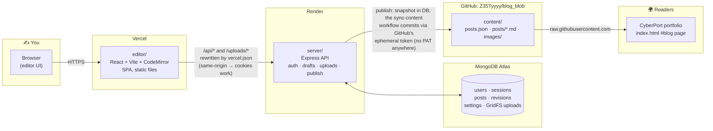
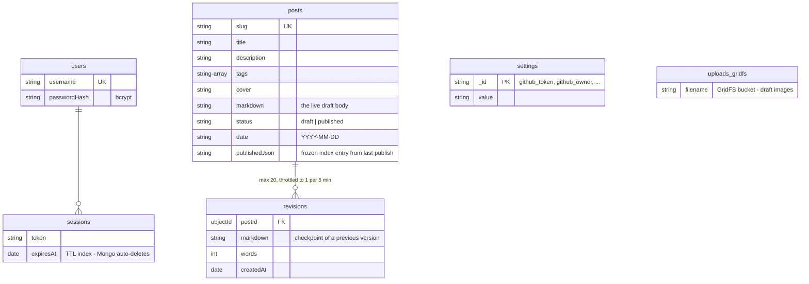
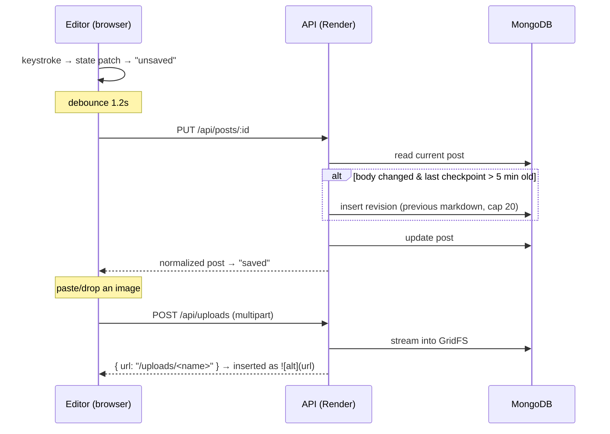
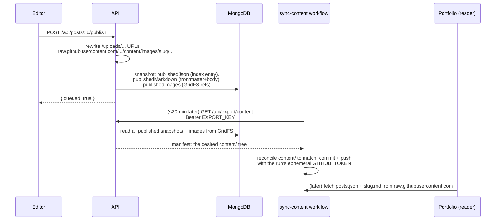
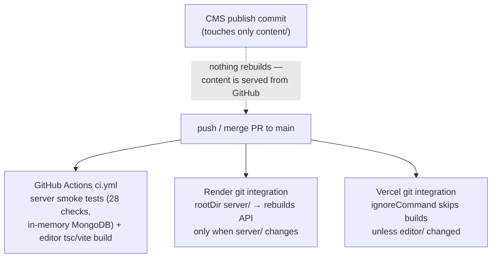

# Architecture

How the blog suite fits together: what runs where, where data lives, and what
happens when you write, publish, and read a post.

## The big picture

Two repos, three moving parts, one static output:



Key idea: **drafting is private and dynamic** (MongoDB behind an authenticated
API), **reading is public and static** (plain files in this repo, fetched from
`raw.githubusercontent.com`). The portfolio never talks to the server — if
Render is asleep or gone, the published blog keeps working.

## The pieces

| Piece | Tech | Lives at | Job |
|---|---|---|---|
| `editor/` | React 18, Vite, TypeScript, CodeMirror 6, marked + DOMPurify | Vercel (static) | Writing UI: markdown editor, live preview, uploads, publish button |
| `server/` | Express, MongoDB native driver, multer | Render (free tier) | REST API: auth/sessions, draft CRUD, revision checkpoints, image uploads, publishing |
| `content/` | plain JSON + markdown + images | this repo, `main` branch | The published blog — the only thing readers ever touch |
| Blog page | vanilla JS in `index.html` | CyberPort repo | Fetches `content/posts.json` + `content/posts/<slug>.md`, renders with marked + DOMPurify |

### Why the Vercel rewrites matter

`editor/vercel.json` rewrites `/api/*` and `/uploads/*` to the Render URL.
The browser only ever sees one origin (the Vercel domain), so the session
cookie is first-party and there is no CORS involved. If the Render service
name changes, update those two destinations.

## Data model (MongoDB)



Two invariants worth knowing:

1. **`content/posts.json` is built from `publishedJson` snapshots, never from
   live rows.** Editing a published post does not change the public blog until
   you explicitly republish. Unpublishing deletes the snapshot.
2. **Draft images live in GridFS, not on disk** — Render's free-tier disk is
   ephemeral. They are served at `/uploads/<file>` behind auth (drafts are
   private), and only copied into the repo at publish time.

## Write path: what happens while you type



Revision checkpoints (the `↺ history` panel in the editor) are snapshots of
the **previous** body taken when a save changes it — throttled so autosave
doesn't produce a revision per keystroke. Restoring one just replaces the
editor content; it still autosaves like any other edit.

## Publish path: draft → public blog

Publishing is a pure database operation; **no GitHub credential exists
anywhere in the system**. The `sync-content` GitHub Actions workflow
(cron every 30 min + a manual Run button) commits published content using
GitHub's own ephemeral `GITHUB_TOKEN`.



The manifest is the *entire* desired `content/` tree, so publish, republish,
unpublish, and image pruning are all the same operation: make the tree equal
the manifest. Unpublishing just drops the snapshots — the next sync removes
the files. If the free-tier API is asleep and can't be woken, the run skips
cleanly and the next tick retries; a failed export commits nothing.

## Auth

First run shows a **setup** screen that creates the single admin user
(bcrypt-hashed). Login issues a random session token stored in Mongo with a
TTL index (Mongo deletes expired sessions itself) and set as an
`HttpOnly` cookie. Every `/api/posts`, `/api/uploads`, `/api/settings` route
sits behind that cookie. Mutating requests are additionally origin-checked
(same host, localhost, or an entry in `ALLOWED_ORIGINS`).

## Deployment & CI

Deploys ride the platforms' own git integrations (Vercel hobby + Render free
tier) — GitHub Actions only runs checks, and needs no secrets.



| Where | What | Credentials it needs |
|---|---|---|
| Render service env | runtime config for `server/` | `MONGODB_URI`, `MONGODB_DB`, `ALLOWED_ORIGINS` (see `render.yaml`) |
| CMS Settings page | publishing | GitHub PAT with write access to this repo (stored in Mongo `settings`) |
| GitHub Actions | `ci.yml` checks only | none |

Publish commits from the CMS only touch `content/**` and deliberately do
**not** trigger a rebuild anywhere: `ci.yml` ignores that path, Render only
watches `server/` (its root directory), and `editor/vercel.json`'s
`ignoreCommand` tells Vercel to skip builds when nothing under `editor/`
changed. The content itself is served straight from GitHub.

## Repo map

```
blog_blob/
├── .github/workflows/   ci.yml — checks on PRs and pushes to main
├── content/             ← the published blog (what readers fetch)
│   ├── posts.json         index, regenerated on every (un)publish
│   ├── posts/<slug>.md    frontmatter + body
│   └── images/<slug>/     images referenced by that post
├── editor/              ← Vite SPA
│   ├── src/api.ts          typed fetch wrapper for every endpoint
│   ├── src/pages/          Login · Posts (list/search) · Editor · Settings
│   └── vercel.json         /api + /uploads rewrites to Render
├── server/              ← Express API
│   ├── src/index.js        app wiring, CSRF/origin guard, static editor build
│   ├── src/auth.js         setup/login/sessions
│   ├── src/posts.js        draft CRUD + revision checkpoints
│   ├── src/uploads.js      multer → GridFS
│   ├── src/publish.js      publish/unpublish orchestration
│   ├── src/github.js       Git Data API (blobs → tree → commit → ref)
│   ├── src/markdown.js     slugify, frontmatter, image URL rewriting
│   └── test/smoke.mjs      end-to-end API suite on mongodb-memory-server
└── render.yaml          Render blueprint for the API service
```
